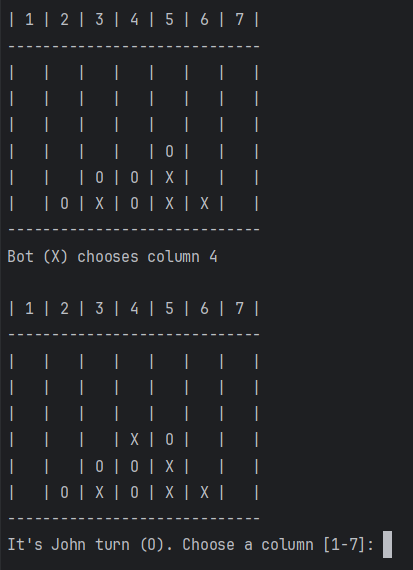

# -- Connect Four Game --
\
This project is an implementation of the **Connect Four** game, playable directly in the terminal. It is written in **C++** and supports two modes: **Human vs Human** and **Human vs A Bot**.

---

## 🎲 Game

The Connect Four is a strategy game where two players compete to align four of their colored tokens in a 6-row by 7-column grid. On each turn, a player places a token in a column, and the first to align four tokens horizontally, vertically, or diagonally wins.

---

## 📦 Features

- Play in the terminal with a clear game board display
- Two modes: Solo (vs Bot) or Duo (2 Players)

---

## 🛠️ How to Compile

### With CMake

1. Clone the repository:

```bash
git clone https://github.com/Lub123456/Connect-Four.git
cd Connect-Four
```

2. Run the following commands:

```bash
cmake -B cmake-build-debug
cmake --build cmake-build-debug
```

---

## ▶️ How to Run

Once compiled, run the program from the terminal:

```bash
./cmake-build-debug/Connect_Four
```

You will be asked to choose between:

- **1**: Solo (you vs the computer)
- **2**: Duo (2 human players)

Then, enter the players' names and the game begins!

---

## 🔜 Preview

Here is a preview of the game interface:



On this link you can find a presentation video of the game:
https://youtu.be/RoUa44Xjk3U

---

## ️🗃️ Project Structure

- `main.cpp`: Program entry point
- `Game.h/Game.cpp`: Game loop and game logic
- `Board.h/Board.cpp`: Manages the game grid and win conditions
- `Player.h/Player.cpp`: Base class for all players
- `HumanPlayer.h/HumanPlayer.cpp`: Human input handling
- `AIPlayer.h/AIPlayer.cpp`: Simple AI that randomly chooses a column

---

## 📌 Notes

- The AI is not really an AI. It's just a simple bot that chooses columns randomly.
- The game was designed to work in a basic terminal (like cmd, PowerShell, or Terminal).

---

## 📝 Author

Lubin TERRIEN – 2025\
Student project for Object-Oriented Programming (C++) class at University of West Attica (Athens, GREECE).


